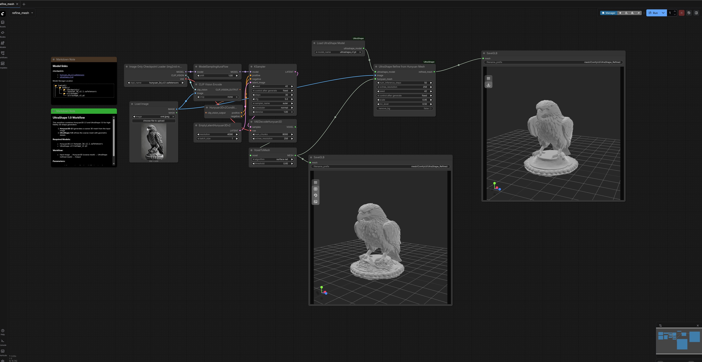

# ComfyUI-UltraShape

ComfyUI nodes for **UltraShape 1.0**: High-Fidelity 3D Shape Generation via Scalable Geometric Refinement.

UltraShape refines coarse 3D meshes (generated by models like Hunyuan3D-2.1) into high-quality, detailed 3D geometry using a two-stage diffusion pipeline with voxel-based refinement.

## 📋 Features

- **Load UltraShape Model**: Load pre-trained UltraShape checkpoint for mesh refinement
- **Refine Mesh from Path**: Refine a mesh file from disk
- **Refine Hunyuan Mesh**: Directly refine meshes generated by Hunyuan3D nodes
- Seamless integration with ComfyUI's 3D workflow
- Full support for batch processing

## The example Workflow

[Example workflow](example_workflows/3d_hunyuan3d-ultrashape-v2.1.json)



## 🎯 What does UltraShape do?

UltraShape takes a **coarse 3D mesh** (like those generated by Hunyuan3D-2.1) and refines it by:
- Adding fine geometric details
- Improving surface quality
- Enhancing mesh topology
- Preserving the overall structure while adding high-frequency details

**Workflow**: `Input Image` → `Hunyuan3D (coarse mesh)` → `UltraShape (refined mesh)` → `Output`


## 📦 Installation

### Option 1: ComfyUI Manager (Recommended)

1. Install [ComfyUI Manager](https://github.com/ltdrdata/ComfyUI-Manager) if you haven't already
2. Open ComfyUI Manager
3. Search for "UltraShape"
4. Click Install
5. Restart ComfyUI

### Option 2: Manual Installation

1. Navigate to your ComfyUI custom nodes directory:
```bash
cd ComfyUI/custom_nodes/
```

2. Clone this repository with submodules:
```bash
git clone --recursive https://github.com/hahihula/ComfyUI-UltraShape.git
```

Or if you already cloned without `--recursive`:
```bash
git clone https://github.com/hahihula/ComfyUI-UltraShape.git
cd ComfyUI-UltraShape
git submodule update --init --recursive
```

3. The UltraShape repository will be automatically cloned as a submodule in `ultrashape_repo/`

4. Restart ComfyUI

## 🐳 Docker Installation

A pre-built Docker image is available with all dependencies:
```bash
docker pull hahihula/comfyui-ultrashape:latest

docker run --gpus all -p 8188:8188 \
  -v $(pwd)/models:/opt/comfyui/models \
  -v $(pwd)/output:/opt/comfyui/output \
  hahihula/comfyui-ultrashape:latest
```

The Docker image includes:
- ComfyUI v0.6.0
- PyTorch 2.8.0 + CUDA 12.8
- Flash Attention 2.8.3
- All UltraShape dependencies pre-installed
- Optimized for NVIDIA RTX 3090 (sm_86)

## 📥 Model Download

Download the UltraShape model checkpoint and place it in the correct directory:
```bash
# Create the ultrashape models directory
mkdir -p ComfyUI/models/ultrashape/

# Download the checkpoint (1.2GB)
wget https://huggingface.co/infinith/UltraShape/resolve/main/ultrashape_v1.pt \
  -O ComfyUI/models/ultrashape/ultrashape_v1.pt
```

Or download manually from: [HuggingFace - infinith/UltraShape](https://huggingface.co/infinith/UltraShape/tree/main)

### File Structure
```
📂 ComfyUI/
├── 📂 models/
│   ├── 📂 checkpoints/
│   │   └── hunyuan_3d_v2.1.safetensors  (for Hunyuan3D-2.1)
│   └── 📂 ultrashape/
│       └── ultrashape_v1.pt              (UltraShape checkpoint)
└── 📂 custom_nodes/
    └── 📂 ComfyUI-UltraShape/
        ├── __init__.py
        ├── nodes.py
        ├── .gitmodules                   (submodule configuration)
        └── 📂 ultrashape_repo/           (git submodule)
            ├── configs/
            │   └── infer_dit_refine.yaml
            ├── ultrashape/
            └── ...
```

## 🎨 Usage

### Basic Workflow

1. **Load Image**: Use `LoadImage` node to load your input image
2. **Generate Coarse Mesh**: Use Hunyuan3D-2.1 nodes to generate a coarse mesh
3. **Load UltraShape Model**: Use `LoadUltraShapeModel` node
4. **Refine Mesh**: Connect everything to `UltraShapeRefineFromHunyuan`
5. **Save Result**: Use `SaveGLB` to export the refined mesh

### Example Workflow
```
LoadImage 
    ↓
[Hunyuan3D Pipeline]
    ↓ (coarse mesh)
LoadUltraShapeModel → UltraShapeRefineFromHunyuan → SaveGLB
    ↑ (same image)    
LoadImage
```

An example workflow is included: `example_workflows/3d_hunyuan3d-ultrashape-v2.1.json`

### Node Parameters

#### LoadUltraShapeModel
- **model_name**: Select the UltraShape checkpoint from dropdown (e.g., `ultrashape_v1.pt`)

#### UltraShapeRefineFromHunyuan
- **ultrashape_model**: Connected from LoadUltraShapeModel
- **image**: The reference image (same as used for coarse mesh generation)
- **hunyuan_mesh**: The coarse mesh from Hunyuan3D
- **num_inference_steps** (default: 50): Number of diffusion steps (higher = better quality, slower)
- **octree_resolution** (default: 1024): Marching cubes resolution (higher = more detail, more memory)
- **seed** (default: 42): Random seed for reproducibility
- **scale** (default: 0.99): Mesh normalization scale
- **mc_level** (default: 0.0): Marching cubes iso-surface level
- **remove_bg** (default: false): Force background removal from image

#### UltraShapeRefine
Same as above, but takes a **mesh_path** (file path string) instead of a MESH object.

## 📊 Performance Tips

- **Lower octree_resolution** (512) for faster processing with slightly less detail
- **Reduce num_inference_steps** (30-40) for faster results
- **VRAM Requirements**: 
  - Minimum: 12GB VRAM
  - Recommended: 16GB+ VRAM
  - octree_resolution=1024 requires ~18-20GB VRAM
- **Processing Time**: ~9-10 minutes for 50 steps on RTX 3090

## 🐛 Troubleshooting

### "No module named 'ultrashape'"
Make sure you cloned with `--recursive` or ran `git submodule update --init --recursive`.

### "Config file not found"
Ensure the UltraShape submodule is properly initialized:
```bash
cd ComfyUI/custom_nodes/ComfyUI-UltraShape
git submodule update --init --recursive
```

### "No module named 'cubvh'"
cubvh needs to be compiled. In the Docker image, this is pre-built. For manual installation:
```bash
pip install git+https://github.com/ashawkey/cubvh --no-build-isolation
```

### "No module named 'flash_attn'"
Flash attention is required. Install the pre-built wheel for your Python version:
```bash
# For Python 3.12 + CUDA 12.x
pip install https://github.com/Dao-AILab/flash-attention/releases/download/v2.7.2.post1/flash_attn-2.7.2.post1+cu12torch2.5cxx11abiFALSE-cp312-cp312-linux_x86_64.whl
```

Or use the Docker image which has it pre-installed.

### Out of Memory Errors
- Lower `octree_resolution` to 512 or 768
- Reduce `num_inference_steps` to 30-40
- Close other GPU-intensive applications

### "index X is out of bounds"
This usually means the coarse mesh has issues. Try:
- Regenerating the coarse mesh with different parameters
- Adjusting the `scale` parameter (try 0.95 or 0.90)

### PyMeshLab OpenGL Warnings
These are harmless warnings about missing OpenGL plugins in headless environments. They don't affect functionality.

## 🔧 Requirements

- Python 3.10-3.12
- CUDA 12.1+ 
- PyTorch 2.5+
- ComfyUI v0.6.0+
- NVIDIA GPU with 12GB+ VRAM

### Key Dependencies
- torch, torchvision, torchaudio
- flash-attn
- pytorch3d
- cubvh
- trimesh
- pymeshlab
- transformers
- diffusers
- omegaconf
- rembg

See `requirements.txt` for complete list.

## 🔗 Links

- **ComfyUI-UltraShape Repository**: [github.com/hahihula/ComfyUI-UltraShape](https://github.com/hahihula/ComfyUI-UltraShape)
- **Original UltraShape Repository**: [PKU-YuanGroup/UltraShape-1.0](https://github.com/PKU-YuanGroup/UltraShape-1.0)
- **Paper**: [arXiv:2512.21185](https://arxiv.org/pdf/2512.21185)
- **Project Page**: [UltraShape 1.0](https://pku-yuangroup.github.io/UltraShape-1.0/)
- **Model Weights**: [HuggingFace - infinith/UltraShape](https://huggingface.co/infinith/UltraShape)
- **Hunyuan3D-2.1**: [Tencent-Hunyuan/Hunyuan3D-2.1](https://github.com/Tencent-Hunyuan/Hunyuan3D-2.1)

## 📝 Citation

If you use this node in your work, please cite:
```bibtex
@article{jia2025ultrashape,
    title={UltraShape 1.0: High-Fidelity 3D Shape Generation via Scalable Geometric Refinement},
    author={Jia, Tanghui and Yan, Dongyu and Hao, Dehao and Li, Yang and Zhang, Kaiyi and He, Xianyi and Li, Lanjiong and Chen, Jinnan and Jiang, Lutao and Yin, Qishen and Quan, Long and Chen, Ying-Cong and Yuan, Li},
    journal={arXiv preprint arXiv:2512.21185},
    year={2025}
}
```

## 📜 License

This project is licensed under the Apache 2.0 License - see the [LICENSE](LICENSE) file for details.

## 🙏 Acknowledgements

- **UltraShape 1.0**: Original implementation by [PKU-YuanGroup](https://github.com/PKU-YuanGroup)
- **Hunyuan3D-2.1**: For providing the coarse mesh generation capability by [Tencent Hunyuan](https://github.com/Tencent-Hunyuan)
- **LATTICE**: For inspiring the core methodology
- **ComfyUI**: For the excellent node-based interface

## 🤝 Contributing

Contributions are welcome! Please feel free to submit a Pull Request.

## 🌟 Star History

If you find this project useful, please consider giving it a star! ⭐

---

**Note**: This is a community-created ComfyUI wrapper for UltraShape 1.0. For issues with the core UltraShape model, please refer to the [original repository](https://github.com/PKU-YuanGroup/UltraShape-1.0).